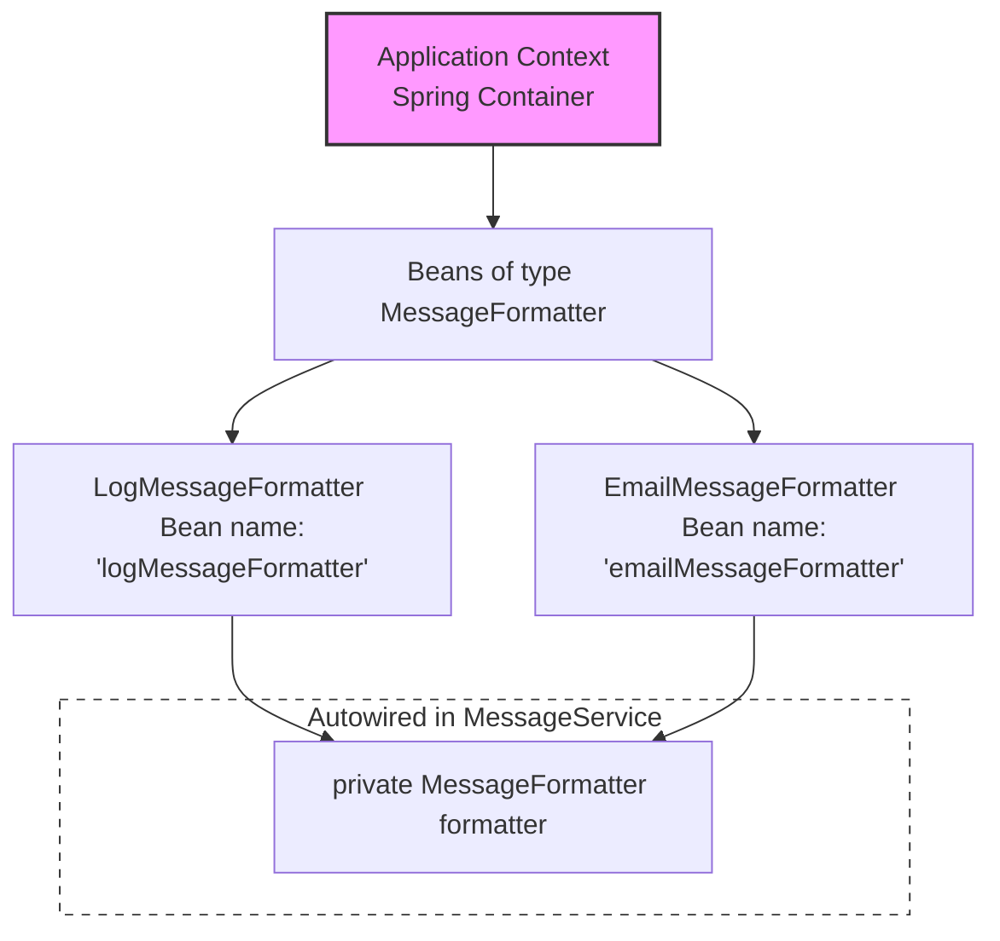

# Spring Framework

To understand Spring, you have to stop thinking like a **Programmer** for a second and start thinking like a **Manager**.

In our *Mini Plugin System*, we were the one doing all the hard work: we manually found the class, called the constructor, and checked the annotations.

<a href="https://github.com/Devansh-Seth-DEV/CapgeminiTraining/blob/main/self-learning/Spring/ReflectionAPI/MiniPluginSystem">
    
</a>

**Spring** is a framework that says:

*Stop doing that. Just give me the blueprints, and I will build, connect, and manage everything for you*.

---

#### 1. The Core Problem: The `new` Nightmare 🧟

Before Spring, if we had a `UserService` that needed a `DatabaseConnector`, we had to write:

```java
UserService service = new UserService(new DatabaseConnector());
```

If `DatabaseConnector` needed a `Logger`, it became:

```java
UserService service = new UserService(
    new DatabaseConnector(new Logger())
);
```

#### 2. The Solution: Inversion of Control (IoC) 🔄

Spring introduces **IoC**. Instead of you controlling the objects, you *Invert* the control to Spring.

Imagine a **Restaurant**.

- **The Programmer:** Is the Owner. You decide what is on the menu.

- **Spring:** Is the Executive Chef. You don't tell the Chef *Go buy a pan, then turn on the stove, then crack the egg.* 
    You just say, *I need an Omelette*, and the Chef handles the tools and ingredients.

When you run your application, Spring doesn't just run your code; it builds an entire world (the **ApplicationContext**) and populates it with objects (**Beans**).

**1. What is a "Bean" ?** 🫘

Think of your Java classes as *Seeds*. When Spring takes that seed, *plants* it in its system, and creates a living object, that object is now a **Bean**.

*In simple terms:* A Bean is just an object that is managed by Spring instead of by you.

**2. What is the "Application Context"?** 🏗️

If Beans are the workers, the **Context** is the Office Building they live in.

**Context** means the environment. When a developer says *It's in the Context*, they mean **Spring** has created this object and it's sitting in the Spring container ready to be used.

*In simple terms:* It is the **Bucket** or **Container** that holds all your *Beans*.

In Spring, the **Application Context** is the brain. It reads your configuration, creates the objects (*Beans*), and links them together.

**3. How it works "Behind the Scenes" (The Reflection Link!)** 🔗

This is why we learned **Reflection** first! Spring is basically a **Giant Reflection Engine**.

<a href="https://github.com/Devansh-Seth-DEV/CapgeminiTraining/tree/main/self-learning/Spring/ReflectionAPI/ReflectionAPIBasics">
    
</a>

When you start a Spring app:

1. **Scanning:** Spring looks at your classes (just like you did with your Plugin System).

2. **Metadata Reading:** It looks for annotations like `@Component` or `@Service`.

3. **Creation:** It uses `constructor.newInstance()` to create the objects.

4. **Wiring (Dependency Injection):** If Class A needs Class B, Spring finds the *Bean* for B in its *Context* and injects it into A using Reflection fields or setters.

---

## 🧱 Getting Started with the Spring Mini Project

To keep this simple, imagine we are building a **Notification System**.

### Setup

Create a new Java Maven Project named `NotificationSystem` in your favourite IDE, we're using [Eclipse IDE](https://www.eclipse.org/downloads/packages/).

- **Package Name (Group ID):** Let's give our project a package named as `com.notifysys`
- **Project Name (Artifact ID):** Name the project as `NotificationSystem`

### Setting up `pom.xml` file

To make sure our code is compatible with the modern Java ecosystem, we'll use [JDK 21](https://www.oracle.com/in/java/technologies/downloads/#java21).

Add these properties into your project's pom file, to change the JDK version to 21.

**pom.xml**

```xml
    <properties>
        <maven.compiler.source>21</maven.compiler.source>
        <maven.compiler.target>21</maven.compiler.target>
    </properties>
```

Now let's add the **Spring Framework** dependencies first, we'll be using *Spring version 6* for that.

To use the **Spring IoC container**, **ApplicationContext**, and manage **Beans**, we need to add the [Spring Context Dependency](https://mvnrepository.com/artifact/org.springframework/spring-context) first.

**pom.xml**

```xml
<dependencies>
      <!-- Source: https://mvnrepository.com/artifact/org.springframework/spring-context -->
    <dependency>
        <groupId>org.springframework</groupId>
          <artifactId>spring-context</artifactId>
          <version>6.2.15</version>
    </dependency>
</dependencies>
```

### 1. The Component 📟

We mark a class with `@Component`. This tells Spring, *I want you to manage this class.*

Let's create a simple `MessageService` class for our *Notification System* that sends alerts.

Create this class inside a package named `com.notifysys.service`.

**MessageService.java**

```java
package com.notifysys.service;

import org.springframework.stereotype.Component;

@Component
public class MessageService {
    public void send(String message) {
        System.out.println("Message received: " + message);
    }
}
```

### 2. The Configuration

We create a configuration class marked with `@Configuration` and `@ComponentScan`. This tells Spring where to look for those `@Component` tags.

Create a class named `AppConfig` inside `com.notifysys.config` package. This class acts as the *map* for Spring.

**AppConfig.java**

```java
package com.notifysys.config;

import org.springframework.context.annotation.ComponentScan;
import org.springframework.context.annotation.Configuration;

@Configuration
// Spring scans this package for @Component, usually we gave the root package name
@ComponentScan("com.notifysys")
public class AppConfig {
}
```

### 3. Initializing the Spring Application Context 🚀

Now, let's use `AnnotationConfigApplicationContext` to start the Spring container. It is a Spring container implementation that loads bean definitions from Java configuration classes using annotations.

Create the `Main` class inside root package i.e `com.notifysys`.

**Main.java**

```java
package com.notifysys;

import com.notifysys.config.AppConfig;
import com.notifysys.service.MessageService;

import org.springframework.context.annotation.AnnotationConfigApplicationContext;

public class Main {
    public static void main(String[] args) {
        // Startup the Context using our Config class
        AnnotationConfigApplicationContext context = new
            AnnotationConfigApplicationContext(AppConfig.class);

        // Ask the Context for the Bean (The object Spring created for us)
        MessageService service = context.getBean(MessageService.class);

        // Use it!
        service.send("Spring is officially running!");

        context.close();
    }
}
```

### 4. Dependency Injection (DI)

Let’s dive into the *Secret Sauce* of Spring: **Dependency Injection (DI)**. This is where Spring stops being just a *Bean storage* and starts being an *Architect*.

Our `MessageService` is currently just printing whatever is passed into it, but it shouldn't just print to the console. It needs a **Formatter** to make the messages look professional (e.g., adding a timestamp or a prefix).

#### The Wiring Concept🔌

Instead of the `MessageService` creating a `Formatter` itself, we will:

1. Create a `LogMessageFormatter` Bean.
2. Tell Spring to **Inject** (plug in) the formatter into the service automatically.

#### Step 1: The New Dependency

Before creating the dependency class `LogMessageFormatter`, we first create an interface called `MessageFormatter`.
This establishes a common contract so that multiple formatter implementations can be added later without changing the dependent code.

Create a new interface called `MessageFormatter` inside package `com.notifysys.model`

**MessageFormatter.java**

```java
package com.notifysys.model;

public interface MessageFormatter {
    String format(String text);
}
```

Now that we have defined the MessageFormatter contract, we can implement it by creating the `LogMessageFormatter` class.

Create a new class `LogMessageFormatter` inside same package i.e `com.notifysys.model` and implement the `format` method of our `MessageFormatter` contract.

**LogMessageFormatter.java**

```java
package com.notifysys.model;

import org.springframework.stereotype.Component;

@Component
public class LogMessageFormatter
    implements MessageFormatter
{
    @Override
    public String format(String text) {
        return "[LOG] " + java.time.LocalTime.now() + " : " + text;
    }
}
```

#### Step 2: The Injection

Now we'll update our `MessageService` logic. We use the `@Autowired` annotation. 

This tells Spring: 
*Hey, when you create this Bean, look in your 'Bucket' (Context) for a LogMessageFormatter and put it here.*

**MessageService.java**

```java
package com.notifysys.service;

import com.notifysys.model.MessageFormatter;

import org.springframework.beans.factory.annotation.Autowired;
import org.springframework.stereotype.Component;

@Component
public class MessageService {
    @Autowired
    private MessageFormatter formatter;     // Spring injects this!

    public void send(String message) {
        String formatted = formatter.format(message);
        System.out.println(formatted);
    }
}
```

Go ahead and run the `Main` file. You should see something like this in the console:

```txt
[LOG] <current-localtime> Spring is officially running!
```

### How Spring Injects Our Formatter 🧩

You might notice in `MessageService` that we never explicitly say we want a `LogMessageFormatter`:

```java
@Autowired
private MessageFormatter formatter;
```

So how does Spring figure out which implementation to use?

- Spring scans the application for classes annotated with **@Component**.

- It finds **LogMessageFormatter** and registers it as a Bean in the Application Context.

- Since **LogMessageFormatter** implements **MessageFormatter**, Spring knows it’s a valid candidate for injection.

- Because **only one implementation exists**, Spring can inject it automatically based on the **type**.

#### Spring’s Default Bean Naming 🏷️

When we annotate a class with `@Component`:

```java
@Component
public class LogMessageFormatter implements MessageFormatter { ... }
```

Spring automatically registers a bean name using the class name with the first letter in lowercase: `"logMessageFormatter"`.

This becomes important if we later have more than one implementation say:

- LogMessageFormatter
- EmailMessageFormatter

Now if we try to autowire by type only we can do something like this in our `MessageService` class.

```java
@Autowired
private MessageFormatter logMessageFormatter;
```

Even with multiple `MessageFormatter` implementations, Spring will inject the bean whose name matches the variable name in this case `LogMessageFormatter`.

> [!TIP]
> Naming your variables the same as the default bean name can sometimes avoid the need for `@Qualifier`.

#### What Happens If Multiple Implementations Exist ? ⚠️

Suppose we add a new implementation:

- LogMessageFormatter
- EmailMessageFormatter

If we try to autowire by type only:

```java
@Autowired
private MessageFormatter formatter;
```

> [!WARNING]
> Spring will throw a `NoUniqueBeanDefinitionException` because it can’t decide which bean to inject.
> Previously it is valid because bean is injected using variable name but now variable name is also not matching with any of the bean names.

There are **two ways to resolve this**:

#### a) Using `@Qualifier`

This explicitly tells Spring which bean to use.

```java
@Autowired
@Qualifier("logMessageFormatter")     // matches the bean name
private MessageFormatter formatter;
```

#### b) Using `@Primary`

We can mark one implementation as the default:

```java
@Component
@Primary
public class LogMessageFormatter implements MessageFormatter { ... }
```

Spring will then prefer the **@Primary** bean whenever a **MessageFormatter** is required.

#### Spring Autowiring Visualization 🖼️



> [!NOTE]
> **Autowiring** is better than manually injecting the dependencies because The `MessageService` doesn't know how to create a formatter; it just knows it needs one. If tomorrow you want an `EmailFormatter` or a `JsonFormatter`, you just change the Bean, and the MessageService code doesn't have to change at all.

### The Constructor Injection

We used `@Autowired` directly on the **private field**. This uses Reflection (specifically `field.setAccessible(true)`) to force the value in.

However, Spring experts often prefer **Constructor Injection**, where you pass the dependency through the constructor like this:

```java
public MessageService(MessageFormatter formatter) {
    this.formatter = formatter;
}
```

The reason Constructor Injection is the favorite of professional developers is simple:

When you use the constructor, you are saying: *To exist, this MessageService absolutely requires a `MessageFormatter`*. You cannot even compile a line of code like `new MessageService()` without providing its dependency.

**Better for Testing**

Imagine you want to write a tiny test for your `MessageService` without starting the whole Spring framework (which can be slow).

- **With Field Injection (`@Autowired` on the field):** If you use `new MessageService()`, the formatter field is `null`. Since it's private, you can't easily set it. Your test will crash with a `NullPointerException` unless you use Reflection to *hack* it in.

- **With Constructor Injection:** You just write `new MessageService(new FakeFormatter())`. It's clean, standard Java. No magic required!

Let's update our `MessageService` to use a **Constructor** instead of a field for the `@Autowired` annotation.

**MessageService.java**

```java
package com.notifysys.service;

import com.notifysys.model.MessageFormatter;

import org.springframework.stereotype.Component;

@Component
public class MessageService {
    private MessageFormatter formatter;

    // Spring sees this and says "I'll find a MessageFormatter for you!"
    public MessageService(MessageFormatter formatter) {
        this.formatter = formatter;
    }

    public void send(String message) {
        String formatted = formatter.format(message);
        System.out.println(formatted);
    }
}
```

> [!IMPORTANT]
> In modern Spring (since version 4.3), if a class only has one constructor, you don't even need to write the @Autowired tag
> Spring will assume you want to use it!

---

## 🧱 Let's Level Up: Understanding the Bean Lifecycle

Spring doesn't just **create objects and forget about them**. It actively manages them throughout their lifecycle from creation to destruction.

There are two important lifecycle stages that developers commonly use:

- `@PostConstruct` : **The First Breath**
  This method runs **after Spring creates the bean and injects all its dependencies**.
  It is typically used for **initialization or setup tasks**.

- `@PreDestroy` : **The Last Words**
  This method runs **just before the application shuts down and the bean is destroyed**.
  It is used for **cleanup tasks**, such as closing database connections or releasing resources.

#### Spring Bean Lifecycle


### 1. Adding an Initialization Hook using `@PostConstruct`.

So far, our `MessageService` works fine, but now let's use the Spring **lifecycle hooks**.

Since we are using modern Java versions, the `@PostConstruct` and `@PreDestroy` annotations are no longer part of the core JDK.
To use them, we need to add the [Jakarta Annotations API Dependency](https://mvnrepository.com/artifact/jakarta.annotation/jakarta.annotation-api) to our `pom.xml`

```xml
<dependency>
    <groupId>jakarta.annotation</groupId>
    <artifactId>jakarta.annotation-api</artifactId>
    <version>2.1.1</version>
</dependency>
```

Now let's update `MessageService` to include a method annotated with `@PostConstruct`

**MessageService.java**

```java
package com.notifysys.service;

import com.notifysys.model.MessageFormatter;

import jakarta.annotation.PostConstruct;

import org.springframework.stereotype.Component;

@Component
public class MessageService {
    private MessageFormatter formatter;

    public MessageService(MessageFormatter formatter) {
        this.formatter = formatter;
    }

    // This runs automatically right after the constructor is called!
    @PostConstruct
    public void postConstruct() {
        System.out.println("MessageService initialized!");

        if (formatter != null) {
            System.out.println("Formatter has been successfully injected.");
        } else {
            System.out.println("WARNING: Formatter is missing!");
        }
    }

    public void send(String message) {
        String formatted = formatter.format(message);
        System.out.println(formatted);
    }
}
```

### 2. Completing the Lifecycle with `@PreDestroy`

Now that we've seen how a bean can run code **when it is created**, let's also see what happens **when it is about to be destroyed**.

Add a `@PreDestroy` method to your `MessageService`.

**MessageService.java**

```java
package com.notifysys.service;

import com.notifysys.model.MessageFormatter;

import jakarta.annotation.PostConstruct;
import jakarta.annotation.PreDestroy;

import org.springframework.stereotype.Component;

@Component
public class MessageService {
    private MessageFormatter formatter;

    public MessageService(MessageFormatter formatter) {
        this.formatter = formatter;
    }

    @PostConstruct
    public void postConstruct() {
        System.out.println("MessageService initialized!");

        if (formatter != null) {
            System.out.println("Formatter has been successfully injected.");
        } else {
            System.out.println("WARNING: Formatter is missing!");
        }
    }

    // This runs right before the Spring container shuts down,
    @PreDestroy
    public void preDestroy() {
        System.out.println("MessageService shutting down...");
    }

    public void send(String message) {
        String formatted = formatter.format(message);
        System.out.println(formatted);
    }
}
```

### 3. Triggering the Cleanup

For the `@PreDestroy` method to run, the Spring container needs to be **properly closed**.

So in your `Main.java`, make sure you call this at the very end of the program:

```java
context.close();
```

When the context closes, Spring will trigger the `@PreDestroy` method for all managed beans.

> [!WARNING]
> If you forget to call `context.close()`, since the Spring container was never told to shut down, the `@PreDestroy` method will never run.

## 🎭 Bean Scope: Singleton vs Prototype

So far, every time we've asked the Spring container for a bean, it has returned **the same object**.

This behavior is controlled by something called **Bean Scope** which defines:
*How many instances of a bean Spring should create and how long they live.*

### 🏠 The Default: Singleton Scope

By default, every bean in Spring has **Singleton scope**.

This means **Spring creates exactly one instance of the bean per ApplicationContext**, and that same instance is reused whenever the bean is requested.

> [!NOTE]
> This is not exactly the *GoF Singleton Pattern*.
> It simply means **one shared instance managed by the Spring container**.

For example, our `MessageService` works perfectly as a Singleton.

**Why?**

- It acts like a **manager/service**.
- It doesn't store user-specific state.
- One shared instance is enough for the entire application.

This approach **reduces memory usage and improves efficiency**.

#### 🧾 When Singleton Is NOT Ideal

Imagine a bean representing a **specific notification or alert for a user**.

Example:

- Email alert for *Alice*
- Battery warning for *Bob*

If this bean were a Singleton, **both alerts would share the same object**, which could cause data conflicts.

That’s where **Prototype scope** comes in.

### 🧬 Prototype Scope

A Prototype bean tells Spring:
*Create a new instance every time someone asks for this bean.*

This is perfect for objects that **contain unique data**.

### Step 1: Create a Prototype Bean

Let's create a new class called `UserAlert` inside our package `com.notifysys.model`.

This bean will represent an **individual alert message**.

To tell Spring to create a **new instance every time**, we use the `@Scope("prototype")` annotation.

**UserAlert.java**

```java
package com.notifysys.model;

import org.springframework.context.annotation.Scope;
import org.springframework.stereotype.Component;

@Component
@Scope("prototype")
public class UserAlert {
    private String message;

    public void setMessage(String message) {
        this.message = message;
    }

    public void show() {
        System.out.println(
            "Alert: " + message + 
            " [Object ID: " + System.identityHashCode(this) + "]"
        );
    }
}
```

> [!NOTE]
> `@Scope("prototype")` annotation tells spring:
> *Do not reuse this bean and create a fresh object every time instead.*

### Step 2: Test the Fresh Instances

Now let's update our `Main.java` to see this behavior in action.

We'll seperate the previous logic and this current logic into seperate methods for better understanding and redability.

Firstly, create a method named `testBeans()` and cut the previous logic from `main()` into this method and then call it inside `main`.

**Main.java**

```java
public static void main(String[] args) {
    testBeans();
}

private static void testBeans() {
    // Startup the Context using our Config class
    AnnotationConfigApplicationContext context = new
        AnnotationConfigApplicationContext(AppConfig.class);

    // Ask the Context for the Bean (The object Spring created for us)
    MessageService service = context.getBean(MessageService.class);

    // Use it!
    service.send("Spring is officially running!");

    context.close();
}
```

Now, create a new method named `testScopePrototype()` method and test the `UserAlert` class.

**Main.java**

```java
public static void main(String[] args) {
    testBeans();
    testScopePrototype();
}

private static void testScopePrototype() {
    AnnotationConfigApplicationContext context = new
        AnnotationConfigApplicationContext(AppConfig.class);

    // First alert
    UserAlert alert1 = context.getBean(UserAlert.class);
    alert1.setMessage("You have a new friend request!");

    // Second alert
    UserAlert alert2 = context.getBean(UserAlert.class);
    alert2.setMessage("Your battery is low!");

    // Display both alerts
    alert1.show();
    alert2.show();

    context.close();
}
```

When you run the program, pay attention to the **Object ID** printed in the console.
Since we've used *Prototype* Spring creates two completely different objects.

You should see something like:

```txt
Alert: You have a new friend request! [Object ID: 345621]
Alert: Your battery is low! [Object ID: 982144]
```

> [!NOTE]
> If `UserAlert` were Singleton, Both alerts would share the same object and the
> `alert2` would overwrite the first one.

---

## 🌍 External Configuration: Making Our App Flexible

So far, our application works great. But there's one small problem.

If we want to change something simple like a message prefix, server URL, or timeout we would have to:

1. Edit the Java code
2. Recompile the application
3. Run it again

That’s not ideal.

Instead, Spring allows us to move such settings **outside the code** into a configuration file.

This is called **External Configuration**.

Spring can then **read these values and inject them into our beans automatically** using the `@Value` annotation.

Let's try it.

### 📝 Step 1: Create the Configuration File

Inside your project, go to: `src/main/resources`

Create a file called `application.properties` and add the following line:

**application.properties**

```properties
notification.prefix=[SYSTEM-ALERT]
```

Think of this file as a **simple key-value storage for application settings**.

### 🛠️ Step 2: Use the Property in a Formatter

Now let's create a new formatter that reads the prefix from our properties file.

Create a new class called `PrefixMessageFormatter` inside our package `com.notifysys.model`

**PrefixMessageFormatter.java**

```java
package com.notifysys.model;

import org.springframework.beans.factory.annotation.Value;
import org.springframework.context.annotation.Primary;
import org.springframework.stereotype.Component;

@Component
@Primary
public class PrefixMessageFormatter
    implements MessageFormatter
{
    @Value("${notification.prefix}")
    private String prefix;

    @Override
    public String format(String text) {
        return prefix + " " + java.time.LocalTime.now() + " : " + text;
    }
}
```

**What's happening here ?**

```java
@Value("${notification.prefix}")
```

Spring reads the value from `application.properties` and **injects it into the `prefix` field**.

Since we marked this formatter as `@Primary`, it'll **prefer this implementation** when injecting `MessageFormatter`.

### 📍 Step 3: Tell Spring Where the Properties File Is

Spring also needs to know **which configuration file to load**.

We do this in our `AppConfig` class using `@PropertySource`.

**AppConfig.java**

```java
package com.notifysys.config;

@Configuration
@ComponentScan("com.notifysys")
@PropertySource("classpath:application.properties")
public class AppConfig {
}
```

`classpath:` tells Spring to look inside `src/main/resources` for the file.

Now run the application.

You should see something like:

```txt
[SYSTEM-ALERT] 14:22:10 : Spring is officially running!
```

#### Try Changing the Prefix

Now change the property:

**application.properties**

```properties
notification.prefix=[IMPORTANT]
```

Run the app again.

No code changes needed **only the configuration changed**.

That’s the power of **external configuration**.

### 🛡️ Step 4: Providing a Default Value

Sometimes a property might be missing.

To avoid application failure, we can provide a **default value** to our `prefix` field inside our `PrefixMessageFormatter` class.

**PrefixMessageFormatter.java**

```java
@Value("${notification.prefix:[DEFAULT]}")
private String prefix;
```

This means:

- If notification.prefix exists use it.
- Else use [DEFAULT]

---

## 📜 The Old Way: XML Bean Configuration

So far, we've been using **annotations** like `@Component`, `@Autowired`, and `@Primary` to let Spring automatically discover and wire our beans.

But Spring wasn't always this convenient.

Before annotations became popular, developers had to **manually describe every bean and its dependencies inside an XML file**.

Yes… **every single one**.

This configuration file was usually called: `beans.xml` or `applicationContext.xml`

Instead of annotations, developers used **XML tags to describe how objects should be created and connected**.

Let's recreate that experience.

### Our Goal

We wll:

1. To avoid breaking our current setup, we'll create **two new classes without Spring annotations**.
2. Define them as beans inside **XML**.
3. Let Spring wire them **using the XML configuration**.

#### Step 1: Create the Classes

First create a class named `OnlineMessageService` inside our package `com.notifysys.service`.

**OnlineMessageService.java**

```java
package com.notifysys.service;

import com.notifysys.model.MessageFormatter;

public class OnlineMessageService {
    private MessageFormatter formatter;

    public OnlineMessageService(MessageFormatter formatter) {
        this.formatter = formatter;
    }

    public void send(String message) {
        String formatted = formatter.format(message);
        System.out.println("[" + System.identityHashCode(this) + "] : " + formatted);
    }
}
```

Notice something interesting here:

- No `@Component`
- No `@Autowired`
- No Spring annotations at all

This is what we call a **POJO (Plain Old Java Object)**.

Now we'll create our next class which is `EmailMessageFormatter` inside `com.notifysys.model` package.
This formatter simply adds an **EMAIL prefix and timestamp**.

**EmailMessageFormatter.java**

```java
package com.notifysys.model;

import java.time.LocalTime;

public class EmailMessageFormatter
    implements MessageFormatter
{
    @Override
    public String format(String text) {
        return "[EMAIL] " + LocalTime.now() + " : " + text;
    }
}
```

#### Step 2: Link the Beans Using XML

Now comes the old-school Spring magic

Create a file called `beans.xml` inside `src/main/resources` and add the following configuration:

**beans.xml**

```xml
<beans xmlns="http://www.springframework.org/schema/beans"
    xmlns:xsi="http://www.w3.org/2001/XMLSchema-instance"
    xsi:schemaLocation="
        http://www.springframework.org/schema/beans
        http://www.springframework.org/schema/beans/spring-beans-3.0.xsd">

    <!-- Formatter Bean -->
    <bean id="emailMessageFormatter"
          class="com.notifysys.model.EmailMessageFormatter" />

    <!-- Service Bean -->
    <bean id="onlineMessageService"
          class="com.notifysys.service.OnlineMessageService">
        <constructor-arg ref="emailMessageFormatter" />
    </bean>

</beans>
```

**What is happening here ?**

Spring will:

1. Create a bean called `emailMessageFormatter`.
2. Create another bean called `onlineMessageService`.
3. Inject the formatter into the service using the constructor.

All of this **without a single annotation in Java**.

> The XML file is responsible for wiring everything together.

#### Step 3: Test the XML Configuration

Now let's run our XML-based beans.

Add a new method in `Main.java` called `testXmlBeans()` and call it inside `main()`.

**Main.java**

```java
public static void main(String[] args) {
    testBeans();
    testScopePrototype();
    testXmlBeans();
}

private static void testXmlBeans() {
    ClassPathXmlApplicationContext context =
            new ClassPathXmlApplicationContext("beans.xml");

    OnlineMessageService service =
            context.getBean(OnlineMessageService.class);

    service.send("Spring is officially running using XML Beans!");

    context.close();
}
```

#### 💡 Fun Fact

Large legacy enterprise applications still have thousands of lines of Spring XML configuration.

---

## 🧩 Wiring More Complex Beans in XML

In the previous section, we used a simple constructor with **one dependency**.

But what happens if a constructor requires **multiple arguments?**

In XML configuration, you simply add **multiple `<constructor-arg>` tags** inside the `<bean>` definition. Spring will then try to match those values to the constructor parameters.

However, when there are several arguments, Spring might get confused about **which value belongs to which parameter**.

To solve this, Spring gives us **two clear strategies**.

Let's update our `OnlineMessageService` with a new field and an overloaded constructor first.

**OnlineMessageService.java**

```java
package com.notifysys.service;

import com.notifysys.model.MessageFormatter;

public class OnlineMessageService {
    private MessageFormatter formatter;
    private String serviceName;        // For showcasing constructor injection

    public OnlineMessageService(MessageFormatter formatter) {
        this.formatter = formatter;
        this.serviceName = "Local Notification Service";
    }

    // New constructor
    public OnlineMessageService(MessageFormatter formatter, String serviceName) {
        this.formatter = formatter;
        this.serviceName = serviceName;
    }

    public void send(String message) {
        String formatted = formatter.format(message);
        System.out.println("[" + System.identityHashCode(this) + "] : " + formatted);
    }
}
```

### 1. Constructor Injection by Index (The "Order" Way)

The first approach is to use the **`index` attribute**.

The index starts from **0**, and it tells Spring exactly which constructor parameter should receive the value.

We could wire it in XML like this:

**beans.xml**

```xml
<bean id="onlineMessageService"
      class="com.notifysys.service.OnlineMessageService">

    <constructor-arg index="0" ref="emailMessageFormatter" />
    <constructor-arg index="1" value="Online Notification Service" />

</bean>
```

> This works perfectly as long as you remember the correct order.

### 2. Constructor Injection by Name (The "Explicit" Way)

A clearer approach is to use **`name` instead of `index`**.

This directly matches the **parameter names in the constructor**, making the configuration easier to read.

**beans.xml**

```xml
<bean id="onlineMessageService"
      class="com.notifysys.service.OnlineMessageService">

    <constructor-arg name="formatter" ref="emailMessageFormatter" />
    <constructor-arg name="serviceName" value="Online Notification Service" />

</bean>
```

Now the mapping becomes very obvious

Most developers prefer this style because it’s **more readable and less error-prone**.

## 🏷️ Setting Bean Properties in XML

Constructors aren't the only way to configure beans.

Sometimes we want to **initialize fields using setter methods** instead.

Spring allows us to do this using the `<property>` tag.

Let’s update `EmailMessageFormatter` with a new field.

**EmailMessageFormatter.java**

```java
package com.notifysys.model;

import java.time.LocalTime;

public class EmailMessageFormatter
    implements MessageFormatter
{
    private String recipient;

    public void setRecipient(String recipient) {
        this.recipient = recipient;
    }

    @Override
    public String format(String text) {
        return "[EMAIL] " + LocalTime.now() +
                " (To=" + recipient + ") : " + text;
    }
}
```

Now we can set the `recipient` property in XML.

**beans.xml**

```xml
<bean id="emailMessageFormatter"
      class="com.notifysys.model.EmailMessageFormatter">

    <property name="recipient" value="admin@example.com"/>

</bean>
```

When Spring creates this bean, it will automatically call:

```java
setRecipient("admin@example.com")
```

> [!IMPORTANT]
> When Spring sees `<property name="X">`, it doesn't look at your fields or your constructor. It looks for a very specific method signature: 
> `public void setX(Type value)`

### ✨ The Shortcut Style: p: and c: Namespaces

Spring also provides **shorter syntax** for property and constructor injection.

Instead of writing nested tags, we can use **XML namespaces**.

First, declare them in the `<beans>` tag:

**beans.xml**

```xml
<beans xmlns="http://www.springframework.org/schema/beans"
       xmlns:xsi="http://www.w3.org/2001/XMLSchema-instance"
       xmlns:p="http://www.springframework.org/schema/p"
       xmlns:c="http://www.springframework.org/schema/c"
       xsi:schemaLocation="
           http://www.springframework.org/schema/beans 
           http://www.springframework.org/schema/beans/spring-beans.xsd">
```

#### Using `p:` for Properties

Instead of writing:

```xml
<property name="recipient" value="admin@example.com"/>
```

We can simply write:

```xml
<bean id="emailMessageFormatter"
      class="com.notifysys.model.EmailMessageFormatter"
      p:recipient="admin@example.com" />
```

#### Using `c:` for Constructor Arguments

Similarly, constructor arguments can use the `c:` namespace.

```xml
<bean id="onlineMessageService"
      class="com.notifysys.service.OnlineMessageService"
      c:formatter-ref="emailMessageFormatter"
      c:serviceName="Online Notification Service" />
```

---

## 🤝 When XML Meets Annotations

At this point you might be wondering:

> If we are using XML… can we still use annotations?

Yes, and this is where Spring becomes **very powerful**.

XML can actually **enable and work together with annotation-based configuration**.

### 🪄 Enabling Annotation Processing

To allow Spring to recognize annotations like:

- `@Autowired`
- `@PostConstruct`
- `@Value`

We need to first **declare the proper XML namespaces and schema locations** inside `<beans>` tag. Otherwise Spring will throw parsing errors.

**beans.xml**

```xml
<beans xmlns="http://www.springframework.org/schema/beans"
       xmlns:xsi="http://www.w3.org/2001/XMLSchema-instance"
       xmlns:context="http://www.springframework.org/schema/context"
       xmlns:p="http://www.springframework.org/schema/p"
       xmlns:c="http://www.springframework.org/schema/c"
       xsi:schemaLocation="
           http://www.springframework.org/schema/beans 
           http://www.springframework.org/schema/beans/spring-beans.xsd
           http://www.springframework.org/schema/context 
           http://www.springframework.org/schema/context/spring-context.xsd">
```

Then to simply recognize annotations we can add this line to our XML file before defining any bean:

```xml
<context:annotation-config/>
```

This tells Spring: *Hey, also process annotations inside my beans*.

### 🔍 Scanning for Components

We can go one step further.

Instead of defining every bean manually in XML, we can ask Spring to **scan packages for annotated classes**.

Add this after `<context:annotation-config/>`

```xml
<context:component-scan base-package="com.notifysys"/>
```

Now Spring will automatically detect classes annotated with:

- `@Component`
- `@Autowire`
- `@PostConstruct`
- `@PreDestroy`

inside the specified package.

So the full `beans.xml` could look like this:

**beans.xml**

```xml
<beans xmlns="http://www.springframework.org/schema/beans"
       xmlns:xsi="http://www.w3.org/2001/XMLSchema-instance"
       xmlns:context="http://www.springframework.org/schema/context"
       xmlns:p="http://www.springframework.org/schema/p"
       xmlns:c="http://www.springframework.org/schema/c"
       xsi:schemaLocation="
           http://www.springframework.org/schema/beans 
           http://www.springframework.org/schema/beans/spring-beans.xsd
           http://www.springframework.org/schema/context 
           http://www.springframework.org/schema/context/spring-context.xsd">

    <!-- Enable annotation processing -->
    <context:annotation-config/>

    <!-- Scan package for annotated beans -->
    <context:component-scan base-package="com.ns"/>

    <!-- Manual XML-defined beans -->
    <bean id="emailMessageFormatter"
          class="com.notifysys.model.EmailMessageFormatter"
          p:recipient="admin@example.com" />

    <bean id="onlineMessageService"
          class="com.notifysys.service.OnlineMessageService"
          c:formatter-ref="emailMessageFormatter"
          c:serviceName="Online Notification Service" />

</beans>
```

Now that we've enabled annotations inside our XML Configuration let's use it inside our `OnlineMessageService` class.

Let's add a new method marked with `@PostConstruct`.

**OnlineMessageService.java**

```java
package com.notifysys.service;

import com.notifysys.model.MessageFormatter;

import jakarta.annotation.PostConstruct;

public class OnlineMessageService {
    private MessageFormatter formatter;
    private String serviceName;        // For showcasing constructor injection

    public OnlineMessageService(MessageFormatter formatter) {
        this.formatter = formatter;
        this.serviceName = "Local Notification Service";
    }

    public OnlineMessageService(MessageFormatter formatter, String serviceName) {
        this.formatter = formatter;
        this.serviceName = serviceName;
    }

    @PostConstruct
    public void postConstruct() {
        System.out.println(serviceName + " initialized successfully!");
    }

    public void send(String message) {
        String formatted = formatter.format(message);
        System.out.println("[" + System.identityHashCode(this) + "] : " + formatted);
    }
}
```

Now go ahead and run the `Main.java` application it should be printing:

```txt
Online Message Service initialized successfully!
[1530446316] : [EMAIL] 05:03:08.264773700 (To=admin@example.com) : Spring is officially running using XML Beans!
```

---

*Congratulations! By reaching this point, you've explored some of the **core concepts of the Spring Framework** from the ground up.*

Happy coding! ☕🚀
